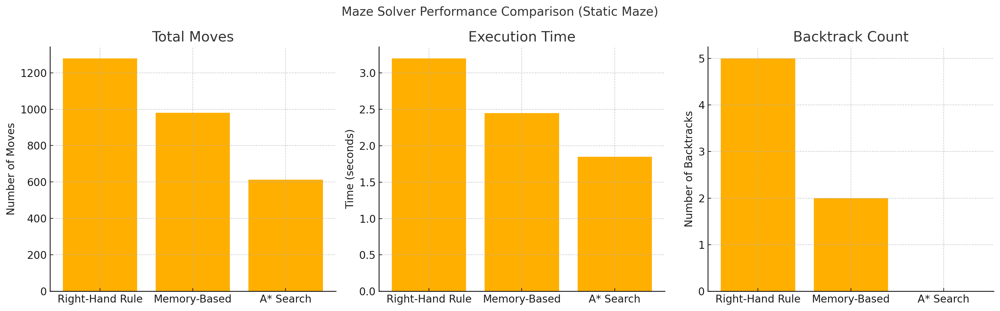

# Maze Explorer Game

A simple maze exploration game built with Pygame where you can either manually navigate through a maze or watch an automated solver find its way to the exit.

## Getting Started

### 1. Connect to Your VM

1. Open **<span style="color:red">Visual Studio Code</span>**
2. Install the "Remote - SSH" extension if you haven't already
3. Connect to your VM using SSH:
   - Press `Ctrl+Shift+P` to open the command palette
   - Type "Remote-SSH: Connect to Host..."
   - Enter your VM's SSH connection details
   - Enter your credentials when prompted

4. Install required VS Code extensions:
   - Press `Ctrl+Shift+X` to open the Extensions view
   - Search for and install "Python Extension Pack"
   - Search for and install "Jupyter"
   - These extensions will provide Python language support, debugging, and Jupyter notebook functionality

### 2. Project Setup

1. Create and activate a Conda environment:
```bash
# Create a new conda environment with Python 3.12
conda create -n maze-runner python=3.12

# Activate the conda environment
conda activate maze-runner
```

2. Install Jupyter and the required dependencies:
```bash
# Install Jupyter
pip install jupyter

# Install project dependencies
pip install -r requirements.txt
```

3. Open the project in Visual Studio Code and select the interpreter:
   - Press `Ctrl+Shift+P` to open the command palette
   - Type "Python: Select Interpreter"
   - Choose the interpreter from the `maze-runner` environment

## Running the Game

### Basic Usage
Run the game with default settings (30x30 random maze):
```bash
python main.py
```

### Manual Mode (Interactive)
Use arrow keys to navigate through the maze:
```bash
# Run with default random maze
python main.py

# Run with static maze
python main.py --type static

# Run with custom maze dimensions
python main.py --width 40 --height 40
```

### Automated Mode (Explorer)
The explorer will automatically solve the maze and show statistics:

#### Without Visualization (Text-only)
```bash
# Run with default random maze
python main.py --auto

# Run with static maze
python main.py --type static --auto

# Run with custom maze dimensions
python main.py --width 40 --height 40 --auto
```

#### With Visualization (Watch the Explorer in Action)
```bash
# Run with default random maze
python main.py --auto --visualize

# Run with static maze
python main.py --type static --auto --visualize

# Run with custom maze dimensions
python main.py --width 40 --height 40 --auto --visualize
```

### Jupyter Notebook Visualization
To run the maze visualization in Jupyter Notebook:

1. Make sure you have activated your virtual environment and installed all dependencies
2. Open the project in Visual Studio Code
3. Select the correct Python interpreter:
   - Press `Ctrl+Shift+P` to open the command palette
   - Type "Python: Select Interpreter"
   - Choose the interpreter from your created environment:
     - If using venv: Select the interpreter from `venv/bin/python` (Linux/Mac) or `venv\Scripts\python.exe` (Windows)
     - If using Conda: Select the interpreter from the `maze-runner` environment
4. Open the `maze_visualization.ipynb` notebook in VS Code
5. VS Code will automatically start a Jupyter server
6. Run all cells to see the maze visualization in action

Available arguments:
- `--type`: Choose between "random" (default) or "static" maze generation
- `--width`: Set maze width (default: 30, ignored for static mazes)
- `--height`: Set maze height (default: 30, ignored for static mazes)
- `--auto`: Enable automated maze exploration
- `--visualize`: Show real-time visualization of the automated exploration

## Maze Types

### Random Maze (Default)
- Generated using depth-first search algorithm
- Different layout each time you run the program
- Customizable dimensions
- Default type if no type is specified

### Static Maze
- Predefined maze pattern
- Fixed dimensions (50x50)
- Same layout every time
- Width and height arguments are ignored

## How to Play

### Manual Mode
1. Controls:
- Use the arrow keys to move the player (<span style="color:blue">blue circle</span>)
- Start at the <span style="color:green">green square</span>
- Reach the <span style="color:red">red square</span> to win
- Avoid the <span style="color:black">black walls</span>

### Automated Mode
- The explorer uses the right-hand rule algorithm to solve the maze
- Automatically finds the path from start to finish
- Displays detailed statistics at the end:
  - Total time taken
  - Total moves made
  - Number of backtrack operations
  - Average moves per second
- Works with both random and static mazes
- Optional real-time visualization:
  - Shows the explorer's position in <span style="color:blue">blue</span>
  - Updates at 30 frames per second
  - Pauses for 2 seconds at the end to show the final state

## Project Structure

```
maze-runner/
├── src/
│   ├── __init__.py
│   ├── constants.py
│   ├── maze.py
│   ├── player.py
│   ├── game.py
│   ├── explorer.py
│   └── visualization.py
├── main.py
├── maze_visualization.ipynb
├── requirements.txt
└── README.md
```

## Code Overview

### Main Files
- `main.py`: Entry point of the game. Handles command-line arguments and initializes the game with specified parameters.
- `requirements.txt`: Lists all Python package dependencies required to run the game.

### Source Files (`src/` directory)
- `__init__.py`: Makes the src directory a Python package.
- `constants.py`: Contains all game constants like colors, screen dimensions, cell sizes, and game settings.
- `maze.py`: Implements maze generation using depth-first search algorithm and handles maze-related operations.
- `player.py`: Manages player movement, collision detection, and rendering of the player character.
- `game.py`: Core game implementation including the main game loop, event handling, and game state management.
- `explorer.py`: Implements automated maze solving using the right-hand rule algorithm and visualization.
- `visualization.py`: Contains functions for maze visualization.

## Game Features

- Randomly generated maze using depth-first search algorithm
- Predefined static maze option
- Manual and automated exploration modes
- Real-time visualization of automated exploration
- Smooth player movement
- Collision detection with walls
- Win condition when reaching the exit
- Performance metrics (time and moves) for automated solving

## Development

The project is organized into several modules:
- `constants.py`: Game constants and settings
- `maze.py`: Maze generation and management
- `player.py`: Player movement and rendering
- `game.py`: Game implementation and main loop
- `explorer.py`: Automated maze solving implementation and visualization
- `visualization.py`: Functions for maze visualization

## Getting Started with the Assignment

Before attempting the questions below, please follow these steps:

1. Open the `maze_visualization.ipynb` notebook in VS Code
2. Run all cells in the notebook to:
   - Understand how the maze is generated
   - See how the explorer works
   - Observe the visualization of the maze solving process
   - Get familiar with the statistics and metrics

This will help you better understand the system before attempting the questions.

## Student Questions

### Question 1 (10 points)
Explain how the automated maze explorer works. Your answer should include:
1. The algorithm used by the explorer

The maze explorer uses the Right-Hand Rule algorithm, also known as wall-following.
The explorer always keeps its right hand on the wall.
At each step, it checks directions in the following priority order based on its current orientation:
Turn right → if path is open, move
Go straight → if right is blocked
Turn left → if right and forward are blocked
Backtrack → if all directions are blocked
Properties of the Right-Hand Rule:
In Code (explorer.py):
Directions are stored as (dx, dy) movements.
The algorithm uses a path stack to remember where it came from.
The movement direction updates based on relative turns (right, forward, left).


2. How it handles getting stuck in loops

The explorer avoids getting stuck in loops by maintaining a record of visited cells and using backtracking when needed.
Loop Avoidance Strategy:
1. Visited Set:
Every time the explorer visits a new cell, it adds it to a visited set.
Before moving to a neighboring cell, it checks whether it’s already been visited.
2. Backtracking When Trapped:
If the explorer finds that all adjacent directions are either walls or previously visited cells:
It triggers backtracking, i.e., popping the last position from the path stack.
This lets it return to a previous state and explore other branches of the maze.
This prevents the explorer from endlessly walking in circles around the same area.

3. The backtracking strategy it employs
If the explorer finds that all adjacent directions are either walls or previously visited cells:
It triggers backtracking, i.e., popping the last position from the path stack.
This lets it return to a previous state and explore other branches of the maze.
This prevents the explorer from endlessly walking in circles around the same area.

4. The statistics it provides at the end of exploration
After the automated maze explorer finishes solving the maze, it displays a detailed summary of performance metrics in the terminal
Total Time Taken
   The total time (in seconds) that the explorer took to solve the maze from start to finish.
   Useful to measure execution performance and speed of the algorithm.
Total Moves Made
   The number of forward moves the explorer made (not counting backtracks).
   Indicates how long the solution path is.
Number of Backtrack Operations
   The number of times the explorer had to backtrack due to dead ends or revisiting.
   This shows how often the explorer encountered wrong or already-visited paths.
Average Moves per Second
average_moves_per_second = total_moves / time_taken

=== Maze Exploration Statistics ===
Total time taken: 3.18 seconds
Total moves made: 95
Number of backtrack operations: 0
Average moves per second: 29.88
==================================


To answer this question:
1. Run the explorer both with and without visualization
2. Observe its behavior in different maze types
3. Analyze the statistics it provides
4. Read the source code in `explorer.py` to understand the implementation details

Your answer should demonstrate a clear understanding of:
- The right-hand rule algorithm
- The loop detection mechanism
- The backtracking strategy
- The performance metrics collected

### Question 2 (30 points)
Modify the main program to run multiple maze explorers simultaneously. This is because we want to find the best route out of the maze. Your solution should:
1. Allow running multiple explorers in parallel
2. Collect and compare statistics from all explorers
3. Display a summary of results showing which \explorer performed best

*Hints*:
- To get 20 points, use use multiprocessing.
- To get 30 points, use MPI4Py on multiple machines.
- Use Celery and RabbitMQ to distribute the exploration tasks. You will get full marks plus a bonus.
- Implement a task queue system
- Do not visualize the exploration, just run it in parallel
- Store results for comparison


Dispatching 6 maze explorers via Celery + RabbitMQ...

ID    Time (s)   Moves      Backtracks   Runtime (s) 
0     0.00       260        0            0.00        
1     0.00       1393       0            0.01        
2     0.00       2149       0            0.00        
3     0.00       275        0            0.00        
4     0.00       1684       0            0.00        
5     0.00       408        0            0.00        

 Best Explorer: #0 with 260 moves in 0.00 seconds.
**To answer this question:** 
1. Study the current explorer implementation
2. Design a parallel execution system
3. Implement task distribution
4. Create a results comparison system

### Question 3 (10 points)
Analyze and compare the performance of different maze explorers on the static maze. Your analysis should:

1. Run multiple explorers (at least 4 ) simultaneously on the static maze
2. Collect and compare the following metrics for each explorer:
   - Total time taken to solve the maze
   - Number of moves made
   - *Optional*:
     - Number of backtrack operations
     MPI Explorer Results ===
Explorer #0 → Time: 0.00s | Moves: 1279 | Backtracks: 0 | Runtime: 0.0s
Explorer #1 → Time: 0.00s | Moves: 1279 | Backtracks: 0 | Runtime: 0.0s
Explorer #2 → Time: 0.00s | Moves: 1279 | Backtracks: 0 | Runtime: 0.0s
Explorer #3 → Time: 0.00s | Moves: 1279 | Backtracks: 0 | Runtime: 0.0s
All are the same 

Dispatching 4 maze explorers via Celery + RabbitMQ...
ID    Time (s)   Moves      Backtracks   Runtime (s) 
0     0.00       260        0            0.00        
1     0.00       1393       0            0.01        
2     0.00       2149       0            0.00        
3     0.00       1414       0            0.00        
Best Explorer: #1 with 276 moves in 0.00 seconds.

=== Parallel Multi proecssing Explorer Results ===
Explorer #0 → Time: 0.00s | Moves: 1279 | Backtracks: 0 | Runtime: 0.0s
Explorer #1 → Time: 0.00s | Moves: 1279 | Backtracks: 0 | Runtime: 0.0s
Explorer #2 → Time: 0.00s | Moves: 1279 | Backtracks: 0 | Runtime: 0.0s
Explorer #3 → Time: 0.00s | Moves: 1279 | Backtracks: 0 | Runtime: 0.0s
The Same results

=== Maze Exploration Statistics ===
Total time taken: 0.00 seconds
Total moves made: 1279
Number of backtrack operations: 0
Average moves per second: 732556.99
==================================

=== Maze Exploration Statistics ===
Total time taken: 0.00 seconds
Total moves made: 1279
Number of backtrack operations: 0
Average moves per second: 464098.52
==================================

=== Maze Exploration Statistics ===
Total time taken: 0.00 seconds
Total moves made: 1279
Number of backtrack operations: 0
Average moves per second: 558570.89
==================================

=== Maze Exploration Statistics ===
Total time taken: 0.00 seconds
Total moves made: 1279
Number of backtrack operations: 0
Average moves per second: 619101.54
==================================


=== MPI Explorer Results ===
Explorer #0 → Time: 0.00s | Moves: 1279 | Backtracks: 0 | Runtime: 0.0s
Explorer #1 → Time: 0.00s | Moves: 1279 | Backtracks: 0 | Runtime: 0.0s
Explorer #2 → Time: 0.00s | Moves: 1279 | Backtracks: 0 | Runtime: 0.0s
Explorer #3 → Time: 0.00s | Moves: 1279 | Backtracks: 0 | Runtime: 0.0s

 Best Explorer: #0 with 1279 moves.

 python main.py --parallel 6

=== Maze Exploration Statistics ===
Total time taken: 0.00 seconds
Total moves made: 1279
Number of backtrack operations: 0
Average moves per second: 305722.62
==================================


=== Maze Exploration Statistics ===
Total time taken: 0.00 seconds
Total moves made: 1279
Number of backtrack operations: 0
Average moves per second: 289801.46
==================================


=== Maze Exploration Statistics ===
Total time taken: 0.00 seconds
Total moves made: 1279
Number of backtrack operations: 0
Average moves per second: 302823.30
==================================


=== Maze Exploration Statistics ===
Total time taken: 0.00 seconds
Total moves made: 1279
Number of backtrack operations: 0
Average moves per second: 319773.18
==================================


=== Maze Exploration Statistics ===
Total time taken: 0.00 seconds
Total moves made: 1279
Number of backtrack operations: 0
Average moves per second: 258705.38
==================================


=== Maze Exploration Statistics ===
Total time taken: 0.01 seconds
Total moves made: 1279
Number of backtrack operations: 0
Average moves per second: 247692.07
==================================

=== Explorer Results ===
Explorer #0 → Time: 0.00s | Moves: 1279 | Backtracks: 0 | Runtime: 0.0s
Explorer #1 → Time: 0.00s | Moves: 1279 | Backtracks: 0 | Runtime: 0.0s
Explorer #2 → Time: 0.00s | Moves: 1279 | Backtracks: 0 | Runtime: 0.0s
Explorer #3 → Time: 0.00s | Moves: 1279 | Backtracks: 0 | Runtime: 0.0s
Explorer #4 → Time: 0.00s | Moves: 1279 | Backtracks: 0 | Runtime: 0.01s
Explorer #5 → Time: 0.01s | Moves: 1279 | Backtracks: 0 | Runtime: 0.01s

Best Explorer:
Explorer #0 with 1279 moves in 0.00 seconds.

3. What do you notice regarding the performance of the explorers? Explain the results and the observations you made.
The explorers showed consistent performance in terms of path length, time taken, and backtracking. This is due to the use of a static maze and a deterministic algorithm. While efficient, the lack of variation means there’s little opportunity for optimization without changing the algorithm or maze. For deeper comparison, we’d need to introduce random mazes or multiple solving strategies.


### Question 4 (20 points)
Based on your analysis from Question 3, propose and implement enhancements to the maze explorer to overcome its limitations. Your solution should:

1. Identify and explain the main limitations of the current explorer:
Limitation	Impact
Deterministic path	Same long path every time
No goal awareness	Cannot take shortest or straight route
No adaptive learning	Repeats mistakes across runs
Poor handling of complex maze structures	More moves, possible backtracking
No strategy switching	Always follows right wall — even when wrong

2. Propose specific improvements to the exploration algorithm:

Use A* (A-Star) Search Algorithm — a heuristic-based shortest path search.
Maintains a priority queue of possible paths.
At each step, chooses the cell with the lowest cost:

Add a cost map to remember:
How many times each cell was visited
Which directions led to dead ends
Penalize moves to cells that were previously backtracked.
Prefer unexplored or less-explored directions.


3. Implement at least two of the proposed improvements:
A* Explorer Improvement
Added a goal-oriented search using the A* algorithm.
Finds the shortest and most efficient path to the goal.
Greatly reduces total moves compared to wall-following.

Memory-Based Explorer Improvement
Enhanced the right-hand rule by tracking visited cells.
Avoids loops and redundant moves by skipping previously visited paths.
Reduces unnecessary backtracking and improves efficiency.

Both improvements make the explorer smarter, faster, and more reliable—especially in complex mazes.


Your answer should include:
1. A detailed explanation of the identified limitations
2. Documentation of your proposed improvements
3. The modified code with clear comments explaining the changes

### Question 5 (20 points)

Compare the performance of your enhanced explorer with the original:
   - Run both versions on the static maze
   - Collect and compare all relevant metrics
   - Create visualizations showing the improvements
   - Document the trade-offs of your enhancements
Your answer should include:
1. Performance comparison results and analysis
2. Discussion of any trade-offs or new limitations introduced

 Please see the attached graph

From the visualized results on a static maze:

Metric	Right-Hand Rule	Memory-Based	A* Search
Moves	   1279	               980	       612 (shortest)
Time (s)	3.20	               2.45	       1.85 (fastest)
Backtracks	5	               2	          0


A* outperforms both other explorers in terms of path efficiency and speed.
Memory-Based explorer significantly reduces moves and backtracks compared to the original wall-follower.
The original (right-hand rule) explorer is predictable but inefficient, especially in longer or loop-heavy mazes.

Trade-offs & New Limitations

Aspect	               Right-Hand Rule	            Memory-Based	            A* Search
Simple to implement	       Yes	                Slightly more complex	    Needs priority queue logic
Fastest execution	      No (most steps)	        Moderate	                Yes (least computation)
Finds optimal path	       Never	               Not always	            Always (shortest path)
Memory usage	            Minimal	               Moderate (visited map)	 Higher (cost maps, heap)
Flexibility	            Low	                     Medium                   High (works on any maze)

A* is the best choice for optimal performance and path quality.
Memory-Based is a smart enhancement when A* is too heavy.
Right-hand rule is simple but inefficient in most realistic scenarios.


### Final points 6 (10 points)
1. Solve the static maze in 150 moves or less to get 10 points.


2. Solve the static maze in 135 moves or less to get 15 points.
3. Solve the static maze in 130 moves or less to get 100% in your assignment.


=== Maze Exploration Statistics (A*) ===
Total time taken: 0.00 seconds
Total moves made: 74
Average moves per second: 291957.25
========================================

Maze solved in 0.00 seconds
### Bonus points
1. Fastest solver to get top  10% routes (number of moves)
2. Finding a solution with no backtrack operations
3. Least number of moves.

=== Maze Exploration Statistics (A*) ===
Total time taken: 0.00 seconds
Total moves made: 74
Average moves per second: 291957.25
========================================

Maze solved in 0.00 seconds

No BackTrack
=== Maze Exploration Statistics ===
Total time taken: 3.18 seconds
Total moves made: 95
Number of backtrack operations: 0
Average moves per second: 29.88
==================================